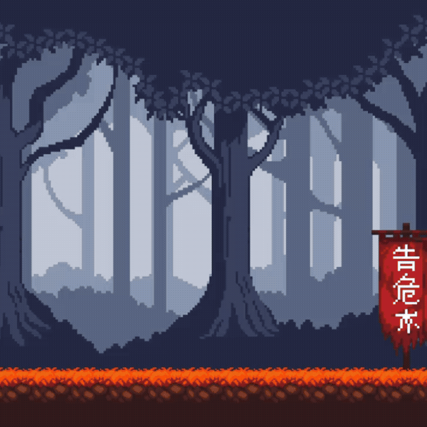

# 2025-10-27

<br>

- [목표](#목표)
- [구현](#구현)
    - [이미지 수정](#이미지-수정)
    - [UI_Mng.cs](#ui_mngcs)
    - [Test.cs](#testcs)
- [결과](#결과)
- [커밋](#커밋)

<br>

## 목표

- 세키로 스타일의 보스 몬스터 처치 시 나타나는 페이드 인 / 아웃 연출 테스트 코드 만들어보기

<br>


## 구현

### _이미지 수정_

`Aseprite` 프로그램을 사용하여 원본이미지를 픽셀화 및 다듬기


<br>


### _UI_Mng.cs_

공용으로 사용할 `Fade` 함수를 코루틴으로 간단히 작성

```csharp
public IEnumerator Fade(Image image, float duration, float targetAlpha)
{
    float startAlpha = image.color.a;
    float time = 0f;
    while (time < duration)
    {
        time += Time.deltaTime;
        float currentAlpha = Mathf.Lerp(startAlpha, targetAlpha, time / duration);
        SetAlpha(image, currentAlpha);
        yield return null;
    }
    SetAlpha(image, targetAlpha);
}

public void SetAlpha(Image image, float alpha)
{
    Color color = image.color;
    color.a = alpha;
    image.color = color;
}
```

<br>


### _Test.cs_
테스트 코드 작성 후, 인스펙터 창에서 `bool` 타입 변수들의 체크박스를 `on/off` 하여 동작 확인
```csharp
public class Test : MonoBehaviour
{
    [SerializeField] private Image background_Clear;
    [SerializeField] private Image background_Death;
    [SerializeField] private Image death_UI;
    [SerializeField] private Image clear_UI;
    [SerializeField] private bool isClear = false;
    [SerializeField] private bool isDeath = false;

    private void Start()
    {
        Base_Mng.Instance.UI.SetAlpha(background_Clear, 0);
        Base_Mng.Instance.UI.SetAlpha(background_Death, 0);
        Base_Mng.Instance.UI.SetAlpha(death_UI, 0);
        Base_Mng.Instance.UI.SetAlpha(clear_UI, 0);
    }

    private void Update()
    {
        if (isClear)
        {
            StartCoroutine(ClearEffect());
            isClear = false;
        }

        if (isDeath)
        {
            StartCoroutine(DeathEffect());
            isDeath = false;
        }
    }

    IEnumerator ClearEffect()
    {
        Base_Mng.Instance.UI.Fade(background_Clear, 1, 1);
        Base_Mng.Instance.UI.Fade(clear_UI, 1, 1);
        yield return new WaitForSeconds(5.0f);
        Base_Mng.Instance.UI.Fade(background_Clear, 1, 0);
        Base_Mng.Instance.UI.Fade(clear_UI, 1, 0);
    }
    
    IEnumerator DeathEffect()
    {
        Base_Mng.Instance.UI.Fade(background_Death, 5, 1);
        Base_Mng.Instance.UI.Fade(death_UI, 0.1f, 1);
        yield return new WaitForSeconds(1.0f);
        Base_Mng.Instance.UI.Fade(background_Death, 5.0f, 0);
        Base_Mng.Instance.UI.Fade(death_UI, 0f, 0);
    }
}
```

<br>

## 결과




<br>

## 커밋
- [feat: ForegroundFader 추가](링크)

<br>
<br>
<br>

← 이전 글 | [다음 글 →](2025-10-28.md)