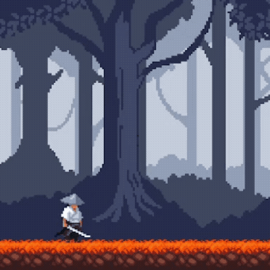
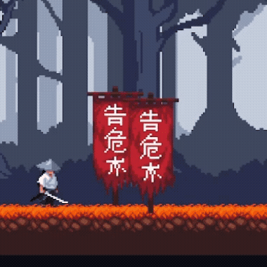

# 2025-10-28

<br>

- [목표](#목표)
- [구현](#구현)
    - [이동](#이동)
    - [점프](#점프)
    - [공격](#공격)
    - [플립](#플립)
    - [애니메이션](#애니메이션)
    - [상태관리](#상태관리)
    - [구조물 투명화](#구조물-투명화)
- [결과](#결과)
- [커밋](#커밋)

<br>

## 목표

- 플레이어의 기본적인 움직임 구현
- 플레이어를 가리는 구조물을 투명화하여 가시성 개선

<br>

## 구현

### _이동_
```csharp
private Vector2 moveInput;
[SerializeField] private float moveSpeed = 5.0f;

void OnMove(InputValue value)
{
    moveInput = value.Get<Vector2>();
}

void FixedUpdate()
{
    if(!isAttacking)
       rb.linearVelocity = new Vector2(moveInput.x * moveSpeed, rb.linearVelocity.y);
    else
        rb.linearVelocity = new Vector2(0f, rb.linearVelocity.y);
}
```

<br>

### _점프_
```csharp
private bool isGrounded;
[SerializeField] private float jumpForce = 10.0f;

void OnJump()
{
    if (isAttacking) return;
    
    if (isGrounded)
    {
        if(currentState == PlayerState.Idle || currentState == PlayerState.Moving)
        {
            rb.linearVelocity = new Vector2(rb.linearVelocity.x, jumpForce);
        }
    }
}

void OnCollisionEnter2D(Collision2D collision)
{
    if (collision.gameObject.CompareTag("Ground"))
        isGrounded = true;
}

void OnCollisionExit2D(Collision2D collision)
{
    if (collision.gameObject.CompareTag("Ground"))
    {
        isGrounded = false;
    }
}
```

<br>

### _공격_
```csharp
private bool isAttacking = false;
[SerializeField] private BoxCollider2D hitBox;

void Update()
{
    if (Input.GetMouseButtonDown(0))
    {
        if (!isAttacking && isGrounded)
        {
            animator.SetTrigger("isAttack");
            StartCoroutine(Attack());
        }
    }
}

IEnumerator Attack()
{
    isAttacking = true;
    
    yield return new WaitForSeconds(0.3f);
    hitBox.enabled = false;
    
    yield return new WaitForSeconds(0.2f);
    
    isAttacking = false;
}

public void EnableHitbox()
{
    hitBox.enabled = true;
}
```

<br>

### _플립_
```csharp
void UpdateFlip()
{
    if (isAttacking) return;
    
    if (moveInput.x > 0)
    {
        transform.localScale = new Vector2(1, 1);
    }
    else if (moveInput.x < 0)
    {
        transform.localScale = new Vector2(-1, 1);
    }
}
```

<br>

### _애니메이션_
```csharp
private Animator animator;

void Awake()
{
    animator = GetComponentInChildren<Animator>();
}

void UpdateMovementAnimation()
{
    if (isGrounded)
    {
        if(Mathf.Abs(moveInput.x) > 0.1f)
            animator.SetBool("isRun", true);
        else
            animator.SetBool("isRun", false);
    }
}

void UpdateJumpAnimation()
{
    animator.SetFloat("yVelocity", rb.linearVelocity.y);
    animator.SetBool("isGrounded", isGrounded);
}
```

<br>

### _상태관리_
```csharp
public enum PlayerState
{
    Idle,
    Moving,
    Jumping,
    Attacking,
}

private PlayerState currentState = PlayerState.Idle;

void UpdateState()
{
    if (isAttacking)
    {
        currentState = PlayerState.Attacking;
        return;
    }
    
    switch (currentState)
    {
        case PlayerState.Jumping:
            if (isGrounded)
            {
                currentState = PlayerState.Idle;
            }
            break;
        case PlayerState.Idle:
            if (Mathf.Abs(moveInput.x) > 0.1f)
            {
                currentState = PlayerState.Moving;
            }
            break;
        case PlayerState.Moving:
            if (Mathf.Abs(moveInput.x) <= 0.1f)
            {
                currentState = PlayerState.Idle;
            }
            break;
        case PlayerState.Attacking:
            if (Mathf.Abs(moveInput.x) > 0.1f)
            {
                currentState = PlayerState.Idle;
            }
            break;
    }
}
```

<br>

### _구조물 투명화_
```csharp
public class ForegroundFader : MonoBehaviour
{
    [SerializeField] private float fadeOutAlpha = 0.2f;
    [SerializeField] private float fadeDuration = 0.3f;
    
    private Dictionary<SpriteRenderer, Coroutine> fadingObjects = new Dictionary<SpriteRenderer, Coroutine>();
    
    private void OnTriggerEnter2D(Collider2D other)
    {
        HandleFade(other, fadeOutAlpha);
    }
    
    private void OnTriggerExit2D(Collider2D other)
    {
        HandleFade(other, 1f);
    }

    private void OnValidate()
    {
        fadeOutAlpha = Mathf.Clamp01(fadeOutAlpha);
    }

    private void HandleFade(Collider2D other, float targetAlpha)
    {
        if (!other.CompareTag("Props")) return;
        
        SpriteRenderer sr = other.GetComponent<SpriteRenderer>();
        if (sr == null) return;
        
        if (fadingObjects.ContainsKey(sr))
        {
            StopCoroutine(fadingObjects[sr]);
        }
        
        fadingObjects[sr] = StartCoroutine(Base_Mng.Instance.UI.Fade(sr, fadeDuration, targetAlpha));
    }
}
```

<br>

## 결과

| Player                    | Props                      |
|---------------------------|----------------------------|
|  |  |

<br>

## 커밋
- [feat: 플레이어 기본 동작 구현](https://github.com/Minssuy99/ronin-isshin-public/commit/af31172d69bc674eef04f6ee1dd4fd4e568d21f6)
- [feat: ForegroundFader 컴포넌트 추가](https://github.com/Minssuy99/ronin-isshin-public/commit/c22c8e59f3fd70c5e12015a8f4a4327cd461dd73)

<br>
<br>
<br>

[← 이전 글](2025-10-27.md) | [다음 글 →](2025-10-28.md)